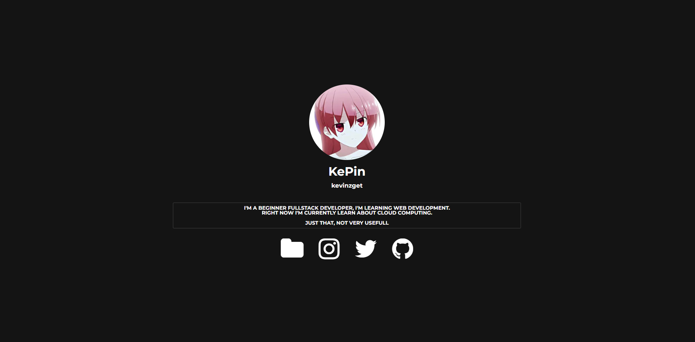
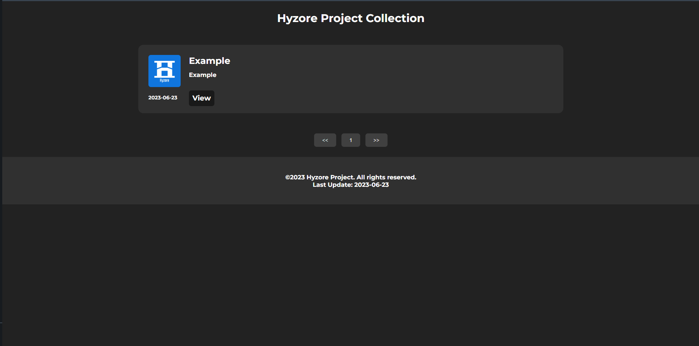
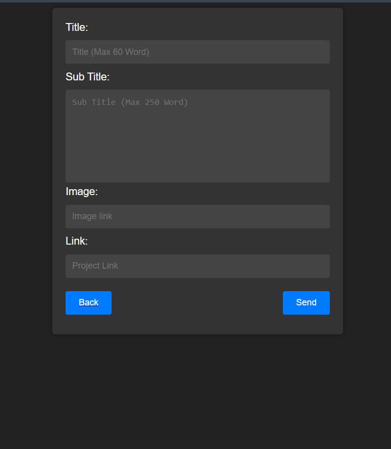
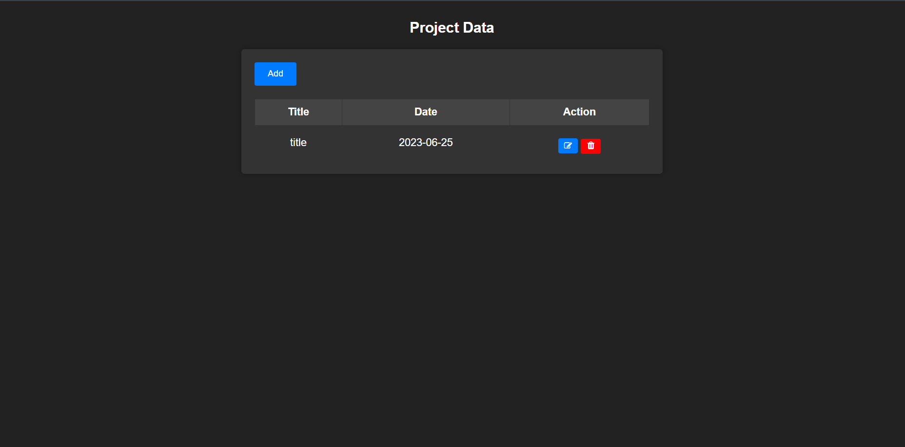
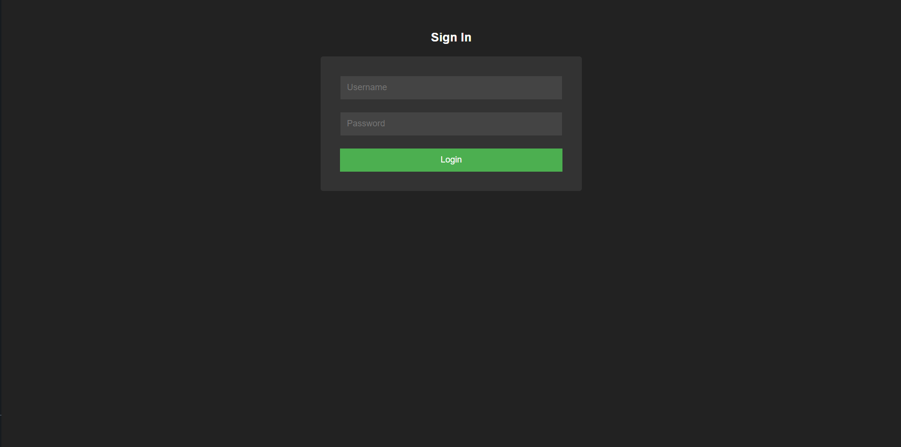
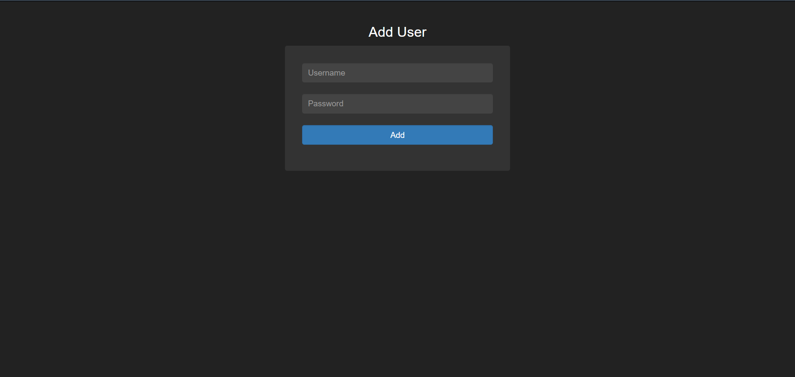

## Hyzore Personal Profile Information

### File Structure
```
📦Hyzore-Personal-Profile
 ┣ 📂src
 ┃ ┣ 📂css
 ┃ ┃ ┣ 📜project.css
 ┃ ┃ ┗ 📜styles.css
 ┃ ┣ 📂img
 ┃ ┃ ┗ 📜Bulk Image
 ┃ ┗ 📂js
 ┣ 📂restricted
 ┃ ┣ 📂forbinden
 ┃ ┃ ┣ 📜add-user.php
 ┃ ┃ ┣ 📜edit.php
 ┃ ┃ ┣ 📜edit-method.php
 ┃ ┃ ┣ 📜data.php
 ┃ ┃ ┣ 📜delete.php
 ┃ ┃ ┣ 📜add-method.php
 ┃ ┃ ┗ 📜add.php
 ┃ ┣ 📜index.php
 ┃ ┣ 📜logged.php
 ┃ ┗ 📜logout.php
 ┣ 📜README.MD
 ┣ 📜conn.php
 ┣ 📜index.php
 ┣ 📜project.php
 ┗ 📜project.sql
 ```

### How To Use - Windows
- Install & Configure [Xamp Control Panel](https://www.apachefriends.org/download.html) the tutorial you can see in youtube.
- Checklist the Apache and Mysql
- Create database named as you want, and Import the project.sql file.
- and make sure fill the conn.php file with your mysql information
- open http://localhost/Hyzore-Personal-Profile/restricted/
- login with Username **admin** and Password **admin**
- Just that you can freely modify the design as you want

### Update
- Now you can login with password_hash() encrypted in http://localhost/Hyzore-Personal-Profile/restricted/index.php
- Now you can add, edit, remove in http://localhost/Hyzore-Personal-Profile/restricted/forbinden/data.php

### Gallery
index.php


project.php


add.php


data.php


edit.php


login


add-user.php

